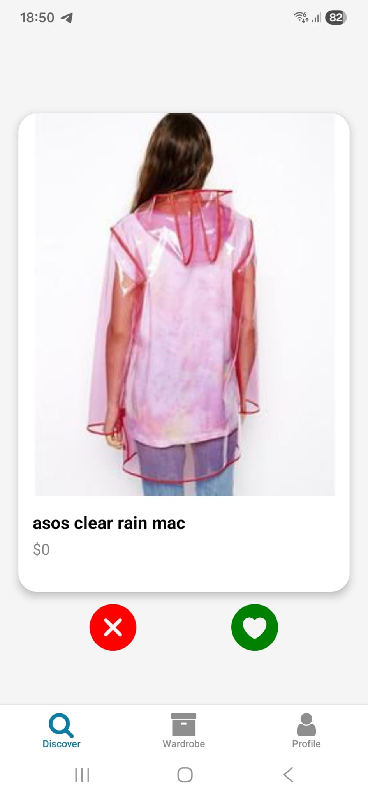
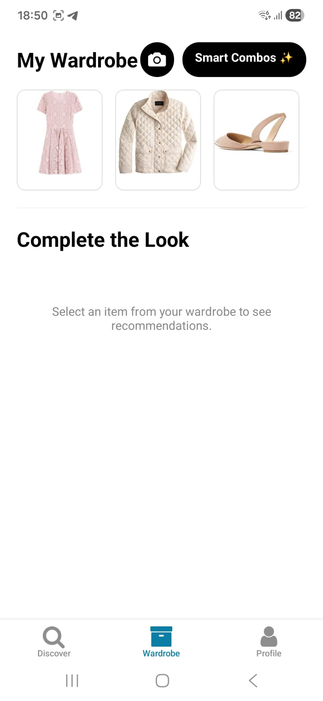
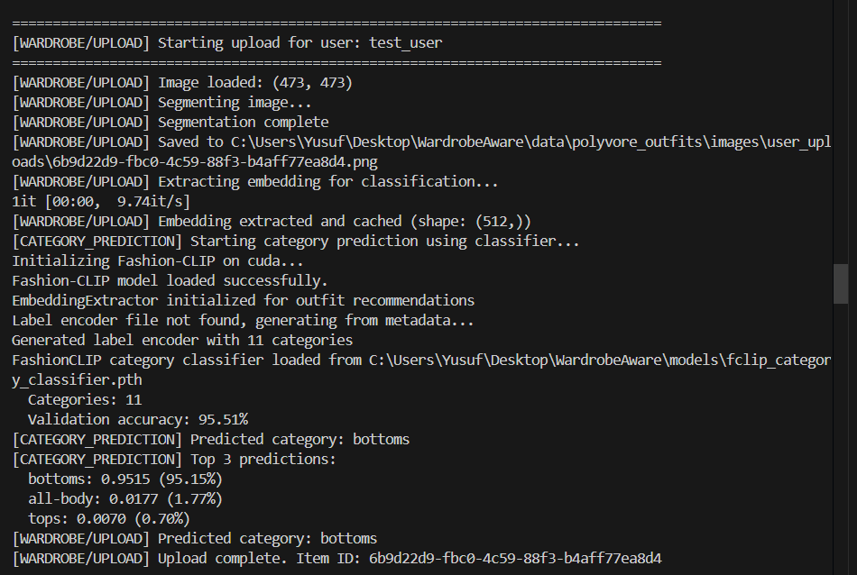
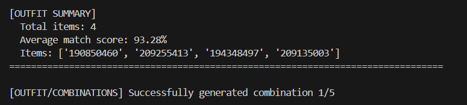
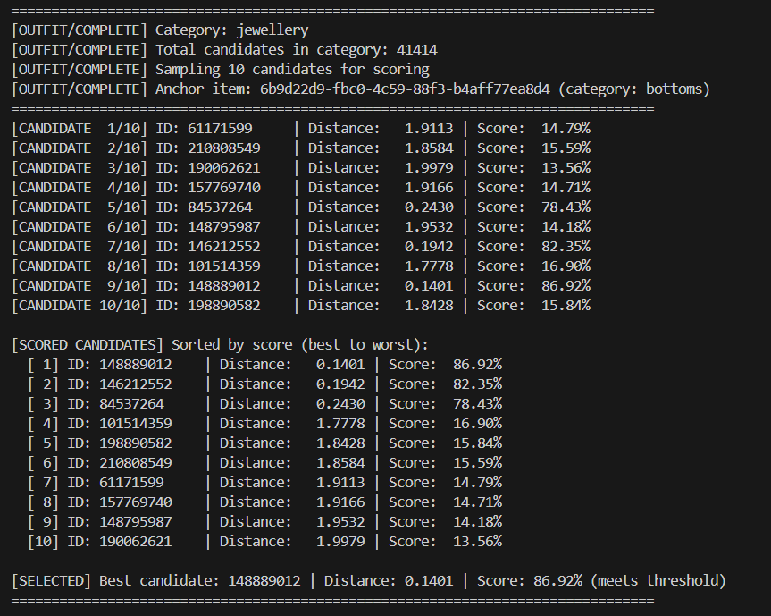
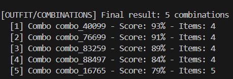

# WardrobeAware - AI-Powered Fashion Recommendation System

A full-stack fashion recommendation system that uses deep learning to understand outfit compatibility and provide personalized style recommendations. The system allows users to upload their own clothing items, automatically segments them, classifies categories, and generates complete outfit combinations.

> [!NOTE] 
> This repository is a refined and structured version of our original project work, specifically organized for final course submission. The development history and initial experimental phases can be found in our **[original development repository](https://github.com/isobed18/fashion-recommender)**.

## 🎯 Features

- **Smart Feed**: Browse fashion items with AI-powered recommendations
- **Outfit Completion**: Get compatible items for any piece (tops, bottoms, shoes)
- **Wardrobe Management**: Upload real photos, auto-remove backgrounds, and add to digital wardrobe
- **Category Classification**: Automatic category prediction using FashionCLIP-based classifier
- **Style Combinations**: Generate complete outfits based on user preferences
- **User Interactions**: Like/swipe system to build personalized taste profiles

## 📸 Application Gallery

<div align="center">

### 📱 Core Experience

| **Smart Discovery** | **Digital Wardrobe** |
|:---:|:---:|
|  |  |
| *Personalized feed based on your taste* | *Manage your collection in one place* |

### 📤 Upload & AI Analysis

| **User Upload** | **Outfit Summary** |
|:---:|:---:|
|  |  |
| *Upload real photos with auto-segmentation* | *Detailed breakdown of your outfit* |

### 🤖 Intelligent Recommendations

| **Compatibility Matching** | **Style Combinations** |
|:---:|:---:|
|  |  |
| *Finding the perfect match for your item* | *Generated full outfit suggestions* |

</div>

## 🎥 Feature Demos

> *Videos showcasing the AI capabilities in real-time.*

### 1️⃣ Top-Based Recommendations
**Scenario:** User uploads a top (upper body) item vs AI suggests matching bottoms and shoes.


https://github.com/user-attachments/assets/2a65f1d7-9bd9-4c25-b676-727221971756


### 2️⃣ Bottom-Based Recommendations
**Scenario:** User uploads a bottom (lower body) item vs AI suggests matching tops and shoes.


https://github.com/user-attachments/assets/195471da-5bbc-4010-90cb-05e7fe2ce13e


### 3️⃣ Dataset-Based Outfit Creation
**Scenario:** Selecting an existing item from the catalog to build a complete outfit.


https://github.com/user-attachments/assets/0ccddf9d-e498-4600-8d58-25fcad018835


### 4️⃣ Smart Combinations from Likes
**Scenario:** Generating unique outfits based on items liked in the Discover/Smart Feed.


https://github.com/user-attachments/assets/d52bb956-95b6-4f70-af30-8e0a8d108ec7


## 🏗️ Architecture

### Backend (FastAPI)
- **Framework**: FastAPI with Uvicorn
- **ML Models**: 
  - TypeAware Recommender (ResNet18/Projection-based compatibility model)
  - FashionCLIP (Image embeddings and category classification)
  - SegFormer (Background removal for uploaded images)
- **Database**: SQLite for user interactions
- **API Endpoints**: Feed, Outfit, Wardrobe, Auth, Swipe

### Frontend (React Native)
- **Framework**: Expo with React Native
- **Navigation**: Expo Router (file-based routing)
- **UI Components**: Custom themed components with animations
- **State Management**: Context API for authentication

### ML Pipeline
- **Embedding Extraction**: FashionCLIP for 512-dimensional image embeddings
- **Compatibility Model**: TypeAware network with category-specific masks
- **Category Classifier**: Fine-tuned FashionCLIP classifier for 11 Polyvore categories
- **Similarity Search**: Pairwise distance calculation for recommendations

## 📁 Project Structure

```
.
├── backend/                 # FastAPI Backend
│   ├── routers/            # API endpoints
│   │   ├── feed.py         # Item feed endpoint
│   │   ├── outfit.py       # Outfit recommendations
│   │   ├── wardrobe.py     # User uploads & category management
│   │   ├── auth.py         # Authentication
│   │   └── swipe.py        # User interactions
│   ├── main.py             # FastAPI app entry point
│   ├── config.py           # Configuration (IP, paths)
│   ├── database.py         # SQLite connection
│   └── requirements.txt    # Python dependencies
│
├── tastematch/             # React Native Frontend
│   ├── app/                # Screens (Expo Router)
│   │   ├── (tabs)/         # Tab navigation
│   │   │   ├── index.tsx   # Feed screen
│   │   │   ├── wardrobe.tsx # Wardrobe management
│   │   │   └── profile.tsx # User profile
│   │   ├── combinations.tsx # Outfit combinations
│   │   └── login.tsx       # Authentication
│   ├── components/         # Reusable UI components
│   ├── constants/         # Config & theme
│   └── src/                # Services & utilities
│       ├── services/       # API client
│       └── context/        # Auth context
│
├── recommender/            # ML Core
│   ├── inference.py        # TypeAwareRecommender class
│   ├── model.py            # TypeAwareNet architecture
│   ├── train.py            # Training script
│   ├── dataset.py          # Polyvore dataset loader
│   └── config.py           # Training configuration
│
├── src/                    # Utilities & ML Components
│   ├── fclip_embedding_extractor.py  # FashionCLIP wrapper
│   ├── segmentation.py               # Background removal
│   ├── train_fclip_classifier.py     # Category classifier training
│   └── fclip_config.py               # FashionCLIP config
│
├── models/                 # Trained model checkpoints
│   └── model_epoch_15.pth  # Main compatibility model
│
├── data/                   # Dataset (not in repo)
│   └── polyvore_outfits/   # Polyvore dataset
│       ├── images/         # Item images
│       └── polyvore_item_metadata.json
│
├── run_server.py           # Server startup script
├── requirements.txt         # Root Python dependencies
└── README.md               # This file
```

## 🚀 Quick Start

### Prerequisites

- Python 3.8+ (with conda recommended)
- Node.js 18+ and npm
- CUDA-capable GPU (optional, for faster inference)

### 1. Backend Setup

```bash
# Create conda environment
conda create -n wardrobeaware python=3.10
conda activate wardrobeaware

# Install dependencies
pip install -r requirements.txt
pip install -r backend/requirements.txt

# Install FashionCLIP (if not included)
pip install fashion-clip

# Set up data directory (download Polyvore dataset)
# Place dataset in: data/polyvore_outfits/
# Structure:
#   data/polyvore_outfits/
#     ├── images/
#     └── polyvore_item_metadata.json

# Update backend/config.py with your IP address
# HOST_IP = "YOUR_IP_ADDRESS"
```

### 2. Frontend Setup

```bash
cd tastematch

# Install dependencies
npm install

# Update API URL in constants/Config.ts
# API_URL = "http://YOUR_IP_ADDRESS:8000"
```

### 3. Running the Application

**Backend:**
```bash
# Option 1: Using run_server.py (recommended for Windows)
python run_server.py

# Option 2: Direct uvicorn
uvicorn backend.main:app --host 0.0.0.0 --port 8000 --reload
```

**Frontend:**
```bash
cd tastematch
npx expo start
# Press 'a' for Android, 'i' for iOS, or scan QR code with Expo Go
```

## 🔧 Configuration

### Centralized IP Configuration (`backend/config.py` and `tastematch/constants/Config.ts`)

To run the application on your local network, you must configure your IP address in two places:

1. **Backend**: Open `backend/config.py` and update `HOST_IP`.
   ```python
   HOST_IP = "192.168.1.6"  # Your machine's LAN IP
   ```

2. **Frontend**: Open `tastematch/constants/Config.ts` and update `API_URL`.
   ```typescript
   const API_URL = 'http://192.168.1.6:8000';
   ```

This ensures that both the backend server and the mobile app (running on a physical device or emulator) can communicate correctly.

## 📡 API Endpoints

### Feed
- `GET /feed/items` - Get paginated fashion items

### Outfit
- `POST /outfit/complete` - Get compatible items for an anchor item
- `POST /outfit/create_from_anchor` - Generate complete outfit from anchor
- `GET /outfit/combinations` - Get outfit combinations for user

### Wardrobe
- `POST /wardrobe/upload` - Upload and segment user image
- `POST /wardrobe/update_category` - Confirm/update item category
- `GET /wardrobe/get_all_categories` - Get all available categories

### Auth
- `POST /auth/register` - User registration
- `POST /auth/login` - User login

### Swipe
- `POST /swipe/like` - Like an item
- `POST /swipe/superlike` - Super like an item

## 🧠 Model Details

### TypeAware Recommender

The core compatibility model uses a TypeAware architecture:
- **Backbone**: ResNet18 (ImageNet pretrained) or EmbeddingProjection (MLP)
- **Input**: Two item images or embeddings
- **Output**: Compatibility distance (lower = more compatible)
- **Score**: `exp(-distance) * 100` (0-100 scale)

### Category Classification

- **Model**: Fine-tuned FashionCLIP classifier
- **Categories**: 11 Polyvore categories (tops, bottoms, shoes, dresses, etc.)
- **Training**: Last layer fine-tuning on Polyvore dataset
- **Usage**: Predicts category for user-uploaded images

### Background Removal

- **Model**: SegFormer (HuggingFace)
- **Purpose**: Remove backgrounds from user-uploaded clothing photos
- **Output**: Segmented PNG images

## 🎓 Training (Optional)

### Train Compatibility Model

```bash
python recommender/train.py \
    --prefix full_model \
    --lambda_l1 0.0005 \
    --epochs 15
```

### Train Category Classifier

```bash
python src/train_fclip_classifier.py
```

## 📊 Dataset

This project uses the **Polyvore Outfits Dataset**:
- **Items**: ~250,000 fashion items
- **Outfits**: Compatible item pairs
- **Categories**: 11 semantic categories
- **Images**: Product photos with metadata

**Note**: The dataset is not included in this repository. You need to download it separately and place it in `data/polyvore_outfits/`.

## 🔒 Environment Variables

Create a `.env` file in the backend directory (optional):

```env
DATABASE_URL=sqlite:///./fashion_recommender.db
SECRET_KEY=your-secret-key-here
```

## 🐛 Troubleshooting

### Backend Issues

1. **Model not found**: Ensure `models/model_epoch_15.pth` exists
2. **Images not loading**: Check `data/polyvore_outfits/images/` path
3. **CUDA out of memory**: Reduce batch size in inference
4. **Import errors**: Ensure you're running from project root

### Frontend Issues

1. **API connection failed**: Check IP address in `constants/Config.ts`
2. **Module resolution errors**: Clear cache with `npx expo start -c`
3. **Build errors**: Delete `node_modules` and reinstall

## 📝 Development Notes

### Key Design Decisions

1. **3 Base Categories**: Recommendations always include tops, bottoms, and shoes
2. **Embedding Caching**: User-uploaded images are cached to avoid re-computation
3. **Batch Processing**: Candidate embeddings are processed in batches for performance
4. **Category Confirmation**: Users can confirm/change predicted categories

### Performance Optimizations

- Embedding caching for uploaded images
- Batch processing for candidate scoring
- Lazy loading of ML models
- Efficient ID lookup with cleaned ID fallback

## 🤝 Contributing

1. Fork the repository
2. Create a feature branch
3. Make your changes
4. Submit a pull request

## 📄 License

See LICENSE file for details.

## 🙏 Acknowledgments

- Polyvore dataset creators
- FashionCLIP model authors
- HuggingFace Transformers
- FastAPI and Expo communities

## 📧 Contact

For questions or issues, please open an issue on GitHub.

---

**Built with ❤️ using FastAPI, React Native, PyTorch, and FashionCLIP**
